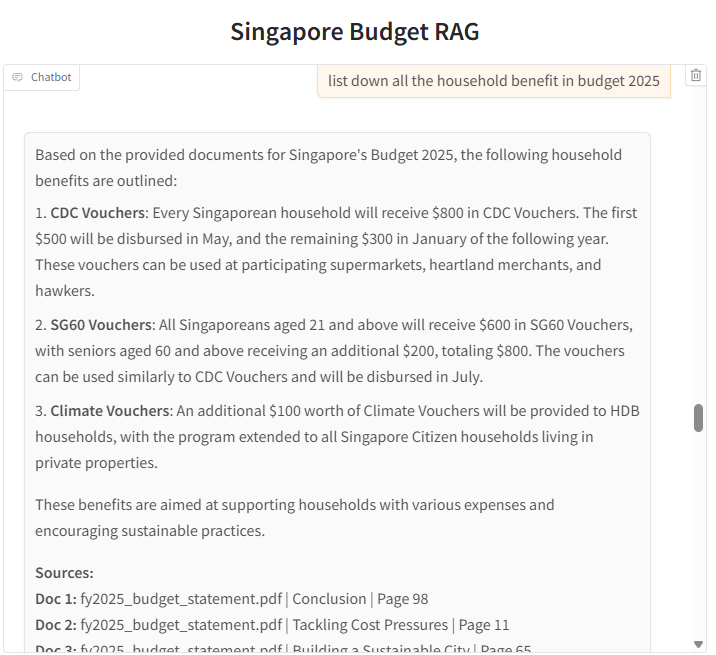
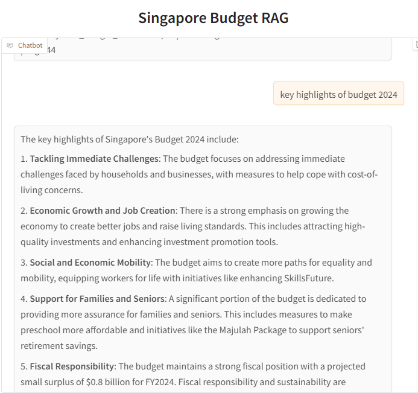

# Singapore Budget Chat Assistant (RAG-based)

This is a Proof-of-Concept (POC) Retrieval-Augmented Generation (RAG) application designed to answer questions based on the **Singapore Budget FY2024 and FY2025** official documents.

It extracts content from the PDFs, chunks and embeds the data using OpenAI Embeddings, and enables interactive querying through a chat interface with **source citation**.

---

## Features

- RAG pipeline using LangChain
- PDF section-aware parsing and chunking
- Metadata-aware chunk-to-vector mapping
- OpenAI embeddings + Chroma vector store
- Gradio chat UI with conversational memory
- Strict document-based answering with proper source citation

---

## Technologies Used

- **Python**
- **LangChain**
- **OpenAI GPT-4o**
- **ChromaDB**
- **OpenAI Embeddings**
- **Gradio**
- **PyPDF2**

---

---

## Sample Answer and Reference Traceability

**Question**: *"What percentage of Singapore’s GDP is spent by the government according to FY2025?"*

**Answer**:  
The documents do not directly specify the percentage of GDP that the Singapore government plans to spend in its Fiscal Year 2025 budget. However, it is mentioned that government spending has been rising steadily from about 15% of GDP to about 18%, and is projected to reach 20% by around 2030. While this provides useful context, a precise figure for FY2025 is not given.

**Sources:**

- `fy2025_budget_statement.pdf` | Introduction | Page 3  
- `fy2025_budget_statement.pdf` | Conclusion | Page 94  

---

## Limitations

- Only supports **FY2024 and FY2025** hardcoded in the logic.
- Prompt templates and LLM config are not yet parameterized.
- No YAML-based config manager (all config is defined inline).
- POC does not include evaluation or retraining pipeline.
- No front-end styling or production-grade deployment.

---

## Future Improvements

- Support additional years dynamically using metadata.
- Externalize all prompt and retriever settings via `config.yaml`.
- Add feedback loop for answer validation and continual embedding.
- Switch to open-source embedding models (e.g. `Instructor`, `BGE`) for offline deployment.
- Improve chunking strategy using sentence boundary detection or table-aware splitting.
- CI/CD for ingestion and retraining pipeline.

---
## Screenshots

### Chat Response Example  1

### Chat Response Example  2

---

## Limitations

- Only supports hardcoded years: **FY2024** and **FY2025**
- Retrieval filter works for each year individually but is **not optimized for FY2024 vs FY2025 comparisons**
- Prompt and model settings are inline (no `config.yaml`)
- Uses OpenAI embeddings (not privacy-compliant for some orgs)
- No structured table extraction for tabular budget data

---

## Future Improvements

- Switch to `sentence-transformers` for **offline-compatible embedding**
- Add support for dynamic year filtering with smarter year-pair comparisons
- Parameterize prompts, filters, and model settings with `config.yaml`
- Integrate feedback loop for validation and retraining
- Add sentence-based or table-aware chunking to improve QA precision
- Deploy with secure frontend and user feedback collection

---

## Disclaimer

This is a proof-of-concept project intended for demonstration purposes only. The code is not optimized for production but is built to show how a working RAG system can deliver insights with document-grounded answers and traceable sources.

---

